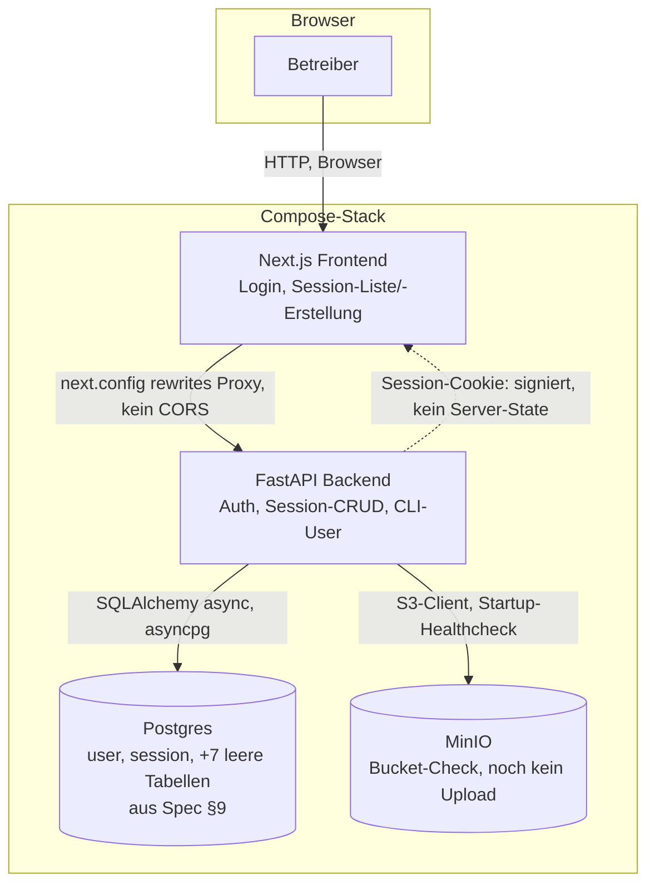

# GrillMe v1 — Phase 1: Grundgerüst (Compose-Stack, Postgres-Schema, Login, Session-CRUD, MinIO)

**Plan ID:** `grillme-v1-phase1-grundgeruest`
**Source PRD:** `/home/felix/projects/grillme-app/.claude/PRPs/grillme-app-223fe1d0/prds/grillme-v1.prd.md`
**PRD Phase:** 1 — Grundgerüst
**Source Issue:** None
**Plan Publication:** None

## Outcome

**Problem:** Der Betreiber kann heute weder eine Idee anlegen noch sich überhaupt anmelden — es existiert kein Anwendungscode, nur die Spezifikation (`.claude/spec.md`) und der Dokumentations-/Compliance-Harness.

**Affected user:** Der Betreiber selbst — Solo-Dev/PM, einziger Nutzer der Instanz (PRD, Primary User).

**User outcome:** `docker compose up` startet einen lauffähigen Stack; der Betreiber meldet sich über die Login-Seite an und sieht seine (anfangs leere) Session-Liste, kann eine neue Session mit gewähltem Ausgabeformat anlegen und sie in der Liste wiederfinden — noch ohne Agent-Anbindung.

**Invariant:** Postgres bleibt die einzige Quelle der Wahrheit für Nutzer- und Session-State (Spec §3.1 gilt schon hier, nicht erst für den Entscheidungsbaum); kein Datenverlust bei einem Backend-Neustart; keine Session-Liste und keine Session-Erstellung ohne gültige, angemeldete Session.

**Success signal:** Deckt sich mit dem PRD-Phasensignal (`grillme-v1.prd.md:207`): „`docker compose up` startet, Login funktioniert, Session anlegen/auflisten funktioniert ohne Agent-Anbindung.“ Geprüft wird das über den Browser (Next.js-Frontend), nicht nur über die API — das Phasenziel spricht explizit von einer „leeren Session-Liste“, nicht nur einem leeren API-Response (siehe Nutzerentscheidung unten).

**Approach:** Vier Docker-Compose-Dienste (Postgres, MinIO, FastAPI-Backend, Next.js-Frontend). Backend: `uv`-verwaltetes Python-Paket nach dem Muster der vier Harness-Engines (`requires-python>=3.12`, Ruff `line-length=100`), FastAPI + SQLAlchemy 2.0 (async, `asyncpg`) + Alembic für das vollständige Schema aus Spec §9, Argon2 (`argon2-cffi`) für Passwort-Hashes, Starlettes eingebautes `SessionMiddleware` (signierter Cookie, kein Server-Session-Store) als Session-Cookie, ein CLI-Kommando für Nutzeranlage. Frontend: minimales Next.js (App Router), Login-Formular + Session-Liste/-Erstellung, per `next.config` Rewrite-Proxy gegen das Backend statt CORS. `prompt_template` wird mit dem Startset aus Spec §6 geseedet, weil `session.format` eine Pflicht-Referenz darauf ist.

## Recommendation

Die kleinste Lösung, die die Foundation nicht später aufreißt: Das volle Datenmodell aus Spec §9 jetzt als Migration anlegen (PRD-Scope-Bullet nennt „Postgres-Schema (Spec §9)“ explizit, nicht nur die zwei für diese Phase gebrauchten Tabellen) — die restlichen sechs Tabellen (`message`, `decision_node`, `image`, `prompt_template`, `artifact`, `achievement`, `token_usage`) bleiben leer, bis Phase 2–5 sie befüllen, kosten aber jetzt nur eine Migration statt einer riskanten Nachmigration mit Fremdschlüsseln auf `session`/`user` mitten in einer laufenden Session-Historie.

Async SQLAlchemy (`asyncpg`) statt synchron: Phase 2 baut die `ag-ui-claude-agent-sdk`/AG-UI-Endpunkte auf demselben FastAPI-Prozess (Spec §3.2, SSE-Transport) — die sind zwingend async. Eine synchrone Datenzugriffsschicht in Phase 1 wäre in Phase 2 ein Treiber- und Session-Management-Rewrite; async jetzt kostet in Phase 1 nichts zusätzlich.

`SessionMiddleware` statt eigener Session-Tabelle: Spec §9 listet keine Auth-Session-Tabelle — nur `user`. Ein zusätzlicher State-Owner für reine Login-Sessions widerspräche „Postgres ist die einzige Quelle der Wahrheit“ nicht direkt, aber er wäre eine Tabelle, die die Spezifikation nicht vorsieht, für ein Problem, das Starlettes mitgelieferte, bereits vorhandene Middleware (kein neuer Dependency, kein neuer State-Owner) ohne Zusatzcode löst.

Next.js-`rewrites()`-Proxy statt CORS: Der Compose-Stack ist Single-Host (Spec §2, „`docker compose up` auf dem eigenen Rechner“). Ein Proxy macht Frontend und Backend zu einer Origin aus Browsersicht — der signierte Session-Cookie braucht dann kein `SameSite=None`/`Secure`-Sonderfall-Handling, und es gibt keine CORS-Konfiguration, die bei jeder neuen Route gepflegt werden müsste.

### Evidence

- `.claude/spec.md:39-52` — Architekturdiagramm: Next.js/CopilotKit ↔ FastAPI/AG-UI ↔ Claude Agent SDK, Postgres, MinIO, Transcriber/Speaker.
- `.claude/spec.md:56-70` (§3.1) — Postgres als einzige Quelle der Wahrheit; SDK-Sessions sind wegwerfbar. Gilt als Präzedenz für „State lebt in Postgres, nicht im Prozess“ auch für Login/Session-CRUD.
- `.claude/spec.md:92-117` (§3.3) — Credential-Kopplung (OAuth-Token vs. API-Key); für Phase 1 nicht relevant (kein Agent-Aufruf), aber bestätigt: `.env`, kein `~/.claude`-Mount.
- `.claude/spec.md:119-124` (§3.4) — „E-Mail und Passwort (Argon2) in Postgres, Session-Cookie. Kein öffentlicher Signup — Nutzer werden per CLI-Kommando angelegt.“
- `.claude/spec.md:226-241` (§6) — Prompt-Bibliothek: Startset `Spec (Markdown)`, `User Stories`, `Tickets`, `PRD`; v1 kommt aus Seed-Daten, keine Verwaltungsoberfläche.
- `.claude/spec.md:287-302` (§9) — Datenmodell-Skizze, alle neun Tabellen inkl. `user_id` auf jeder nutzerbezogenen Tabelle.
- `grillme-v1.prd.md:194,202-207` — Phase-1-Zeile und -Detail: Scope-Bullets (Postgres-Schema, Argon2-Auth, Session-Cookie, CLI-Nutzeranlage, MinIO-Service) und Erfolgssignal.
- `compliance-base/catalog/stack.json` — alle 25 GDPR-Capability-Einträge haben `"chosen": null` (per Codebase-Explorer-Report bestätigt); keiner ist Postgres-Schema/Argon2/Session-Cookie als wählbare Komponente zugeordnet — diese sind Produktentscheidungen aus der Spec, kein Stack-Compiler-Gap.
- `stack-base/scripts/gate_lib.py:294-295` / `validate.py:294-295` — mit `chosen_total == 0` meldet das Gate „no component chosen yet — gate skipped“: Phase 1 wird von `st-validate`/`co-post-tooluse` nicht blockiert.
- `stack-base/_shared/repo_guard.py:1-10` — Der „niemals unter `.claude/`“-Zwang gilt nachweislich nur für die vier Harness-Engines' Doku-/Wissens-Outputs, nicht für Produktcode.
- `.claude/settings.json:1-99` — alle sechs Hook-Gruppen matchen nur auf `tool_name`/Event, nie auf Pfad; die zwei `PostToolUse`-Hooks filtern zusätzlich intern auf `.claude/PRPs/{prds,plans}/**`. Ein neues `backend/`, `frontend/`, `docker-compose.yml` löst keine zusätzliche Hook-Logik aus.
- `claudemd-lerner/config.json:8-14` — `excluded_dirs` default (`node_modules`, `.venv`, `dist`, `build`, `.git`) deckt neue App-Verzeichnisse bereits ab; keine Config-Änderung nötig.
- Codebase-Explorer-Report — kein Root-`.gitignore`, kein Root-`pyproject.toml`/Workspace; jede der vier Engines ist ein unabhängiges `uv`-Paket (`requires-python>=3.12`, Ruff `line-length=100`) — dasselbe Muster für ein neues Backend-Paket ist die einzige belastbare Präzedenz im Repo.
- Knowledge-Base (`concepts/grillme-app-repository.md`, zitiert von `kb-researcher`) — „Dieses Verzeichnis wird zum eigenen Repository, sobald die Implementierung beginnt“ (Spec-Zeile 7-8): Produktcode gehört in dieses Repo, nicht in ein neues, separates.
- Knowledge-Base (`concepts/framework-filter-not-enforced.md`) — Standing-Warnung: `stack.py --scaffold` in diesem Repo nicht erneut laufen lassen, solange Upstream-Issue #46 offen ist (43 verwaiste SOC2/ISO27001-Keys). Für diesen Plan nicht relevant (keine Scaffold-Aufgabe), aber als Randnotiz erwähnenswert, falls jemand während der Arbeit an `compliance-base` vorbeikommt.

### Alternatives considered

- **Sync SQLAlchemy (`psycopg`) statt async:** verliert gegen die Async-Anforderung, die Phase 2 (AG-UI/SSE) ohnehin stellt — würde die Datenzugriffsschicht ein zweites Mal anfassen.
- **Eigene Session-Tabelle statt `SessionMiddleware`:** verliert, weil sie einen State-Owner einführt, den weder Spec §9 noch die Invariante („Postgres hält Nutzer/Session-State“, nicht „Postgres hält Login-Zustand“) verlangen — der signierte Cookie ist der bereits vorhandene, kleinere Mechanismus.
- **CORS mit geteiltem Cookie-Domain statt Rewrite-Proxy:** verliert für v1 (Single-Host-Betrieb), weil er dieselbe Sicherheit mit mehr laufend zu pflegender Konfiguration liefert; wird relevant, sobald Phase-2-Hosting (PRD „Won't Building“, Spec §10) Frontend und Backend auf getrennte Domains verteilt.

## Visuals

Neu in diesem Schritt: alle vier Knoten. `PG` trägt bereits das volle Schema, aber nur `user`/`session` sind aktiv befüllt — die übrigen sieben Tabellen sind Fundament für Phase 2–5, kein toter Code.

## Implementation Context

### Mandatory reading

| File | Why it matters |
|---|---|
| `.claude/spec.md:39-124` | Architektur, Agent-State-Invariante (§3.1, gilt analog), Credentials (§3.3, nicht diese Phase aber grenzt sie ab), Anmeldung (§3.4) |
| `.claude/spec.md:226-302` | Prompt-Bibliothek-Startset (§6, Seed-Daten für `prompt_template`) und volles Datenmodell (§9) |
| `grillme-v1.prd.md:118-148,192-207` | MoSCoW-Tabelle, MVP-Scope, User-Flow, Phase-1-Scope und -Erfolgssignal — die Quelle der Wahrheit für das, was diese Phase liefern muss und was nicht |
| `CLAUDE.md` (`### Commands`, `### Test`) | Repo-Konventionen für `uv`-Pakete, damit `backend/` sich einreiht statt einen Sonderfall zu bilden |

### Existing patterns and primitives

- **`uv`-Paketform:** `claudemd-lerner/pyproject.toml`, `knowledge-base/pyproject.toml`, `stack-base/pyproject.toml` (identisch) — `requires-python = ">=3.12"`, `[tool.ruff] line-length = 100`. `backend/pyproject.toml` übernimmt dieselbe Form als unabhängiges Paket (kein Workspace existiert, keiner wird gebraucht).
- **`from __future__ import annotations`:** in jedem Modul der vier Engines (z. B. `stack-base/_shared/settings.py:11`) — Konvention für neue `backend/`-Module übernehmen.
- **Stdlib-`unittest` unter `_shared/tests`:** Repo-Konvention der vier Engines; für `backend/` bewusst **nicht** übernommen (siehe Task 7 — pytest ist für FastAPI/Async-Tests der stehende Standard, und `backend/` ist ein unabhängiges Paket, das die „kein pytest“-Aussage in `CLAUDE.md` nicht berührt, weil die sich nachweislich nur auf die vier Engines bezieht).
- **Hook-unabhängiger Schreibraum:** `.claude/settings.json:1-99` beweist, dass kein Hook auf Produktcode-Pfade reagiert — `backend/`, `frontend/`, `docker-compose.yml` sind frei von Harness-Nebenwirkungen.

### Integration points

- `.claude/settings.json:97` — `PRP_HOME=.claude/PRPs`; dieser Plan und künftige PRDs/Pläne bleiben dort, unabhängig vom neuen Produktcode.
- `claudemd-lerner/scripts/update.py:48-63,58` — `REPO_ROOT.rglob("CLAUDE.md")` läuft ungeprunt über den ganzen Baum, filtert danach über `excluded_dirs`; `node_modules`/`.venv`/`dist`/`build` sind bereits im Default enthalten (`claudemd-lerner/config.json:8-14`), keine Aktion nötig.

## Scope

### In scope

- Docker-Compose-Stack: Postgres, MinIO, FastAPI-Backend, Next.js-Frontend, gemeinsames `.env`.
- Vollständiges Postgres-Schema aus Spec §9 als Alembic-Migration (alle neun Tabellen), aktiv genutzt: `user`, `session`, `prompt_template` (geseedet).
- Argon2-Login (E-Mail/Passwort), Session-Cookie (`SessionMiddleware`), CLI-Kommando für Nutzeranlage.
- Session-CRUD: Anlegen (mit Formatwahl aus `prompt_template`) und Auflisten, ohne Agent-Anbindung.
- Next.js-Login-Seite und Session-Liste/-Erstellungs-Seite, gegen das Backend verdrahtet.
- MinIO-Anbindung: Service läuft, Backend prüft/erstellt den Bucket beim Start — kein Upload-Endpunkt.
- README.md-Kurzanleitung (`docker compose up`, CLI-Nutzeranlage) — heute nur der Projekttitel.

### Not building

- Claude-Agent-SDK-/AG-UI-Integration, Entscheidungsbaum, Chat — Phase 2.
- Voice-Input/-Output, Transcriber/Speaker-Interfaces — Phase 3.
- Durchblätterbarer Verlauf, Screenshot-Upload (MinIO-Schreibpfad) — Phase 4.
- Abschluss-Bestätigung, Artefakt-Export, Gamification-Anzeige — Phase 5 (die `achievement`-Tabelle existiert bereits durchs Schema, wird aber in dieser Phase nicht geseedet).
- Verwaltungsoberfläche für die Prompt-Bibliothek (PRD „Won't“) — `prompt_template` bekommt nur das Startset per Seed-Skript.
- Mehrbenutzerbetrieb/API-Key-Umschaltung, CopilotKit-Integration im Frontend (erst mit AG-UI in Phase 2 gebraucht).
- Auswahl konkreter Compliance-Komponenten in `compliance-base/catalog/stack.json` (`st-select`) — bleibt bewusst offen (`chosen: null`), das Gate ist inaktiv (`gate skipped`, `validate_mode: warn`), siehe Risks.

## Compliance

**Capabilities**: none — dieser Plan liefert das Produkt-eigene Login (Argon2, Session-Cookie) und das Postgres-Schema aus Spec §9, aber keine der in `compliance-base/catalog/capabilities.md` katalogisierten Komponenten (Consent-Capture, Verschlüsselungs-/Secrets-Infra, Backup/Restore, DSR-Intake usw.). `stack.json` hat für alle 25 zugeordneten GDPR-Capabilities weiterhin `"chosen": null` — das ist der beabsichtigte Zustand (`gate_lib.py:294-295`: Gate meldet „skipped“ solange nichts gewählt ist), keine Lücke, die dieser Plan schließt. `user.email`/`user.password_hash` sind personenbezogene Daten und machen mehrere Capabilities grundsätzlich anwendbar (siehe `stack.json`), aber ihre technische Umsetzung (Verschlüsselung, Zugriffskontrolle, Aufbewahrung, Betroffenenrechte) ist explizit Spec-§8/§10-Scope für die Hosting-Phase, nicht für dieses Grundgerüst.

## Implementation

### 1. Repo-Grundgerüst: Compose-Stack-Skelett und Paketstruktur

**Files and integration points**
- `docker-compose.yml` — CREATE, Repo-Root: Dienste `postgres`, `minio`, `backend`, `frontend`.
- `.env.example` — CREATE, Repo-Root: `POSTGRES_*`, `MINIO_*`, `SESSION_SECRET`, `CLAUDE_CODE_OAUTH_TOKEN`/`ANTHROPIC_API_KEY`-Platzhalter (Spec §3.3 — für diese Phase ungenutzt, aber schon vorgesehen, damit Phase 2 nicht die `.env`-Struktur ändert).
- `.gitignore` — CREATE, Repo-Root: `node_modules/`, `.venv/`, `__pycache__/`, `.next/`, `.env`, plus alles, was die vier Engine-`.gitignore`s bereits je für sich pflegen (kein Root-`.gitignore` existiert heute, siehe Codebase-Analyst-Report).
- `backend/pyproject.toml` — CREATE: `requires-python=">=3.12"`, `[tool.ruff] line-length=100`, Deps `fastapi`, `uvicorn[standard]`, `sqlalchemy>=2.0`, `asyncpg`, `alembic`, `argon2-cffi`, `itsdangerous` (für `SessionMiddleware`), `python-dotenv`, `minio`; Dev-Deps `pytest`, `pytest-asyncio`, `httpx`.
- `frontend/` — CREATE: `create-next-app`-Grundgerüst (TypeScript, App Router), `next.config.js` mit `rewrites()` auf `backend`.

**Implementation**
- `docker-compose.yml` folgt Spec §3 (Diagramm) 1:1: vier Services, `backend`/`frontend` bauen aus lokalem Dockerfile, `postgres`/`minio` aus offiziellen Images (`postgres:16-alpine`, `minio/minio`). `depends_on` mit `condition: service_healthy` für Postgres/MinIO, damit `backend` nicht gegen eine noch startende DB migriert.
- Backend-Paketstruktur folgt der `uv`-Konvention der vier Harness-Engines (siehe Evidence) — eigenständiges Paket, kein Workspace-Member, `from __future__ import annotations` in jedem Modul.
- `next.config.js`: `rewrites()` leitet `/api/:path*` auf `http://backend:8000/:path*` (Compose-DNS-Name) — Begründung siehe Recommendation.

**Tests**
- Keine Logik in diesem Task — abgedeckt durch den End-to-End-Smoke-Test in Task 8.

**Validation**
- `docker compose config` — Compose-Datei ist syntaktisch valide.
- `uv run --directory backend python -c "import fastapi, sqlalchemy, alembic, argon2"` — Paket installiert sich, alle Kern-Deps importierbar.

### 2. Postgres-Schema: SQLAlchemy-Modelle + Alembic-Migration (Spec §9, vollständig)

**Files and integration points**
- `backend/app/models.py` — CREATE: SQLAlchemy-2.0-ORM-Modelle für alle neun Tabellen aus Spec §9 (`user`, `session`, `message`, `decision_node`, `image`, `prompt_template`, `artifact`, `achievement`, `token_usage`), inkl. `user_id`-Fremdschlüssel auf jeder nutzerbezogenen Tabelle (Spec §9, letzter Satz).
- `backend/app/db.py` — CREATE: Async-Engine (`asyncpg`), `AsyncSession`-Factory, FastAPI-Dependency `get_db()`.
- `backend/alembic/` — CREATE: Alembic-Setup, erste Migration erzeugt alle neun Tabellen aus `models.py`.

**Implementation**
- `user`: `id`, `email` (unique), `password_hash` (Argon2), `anthropic_api_key` (nullable, verschlüsselt — Spaltentyp jetzt anlegen, Verschlüsselungslogik ist Phase-2-Scope/Multi-User, hier nur die Spalte laut Spec §3.3/§9).
- `session`: `id`, `user_id` (FK), `format_id` (FK auf `prompt_template`), `status`, `completed_at` (nullable).
- `prompt_template`: `id`, `name`, `output_template`, `interview_focus`, `is_system` (Bool, Spec §6 — „System-Einträge sind kopierbar, nicht überschreibbar“, diese Phase erzwingt das noch nicht per Constraint, nur das Datenmodell).
- Übrige sechs Tabellen (`message`, `decision_node`, `image`, `artifact`, `achievement`, `token_usage`) exakt nach Spec §9-Skizze, ohne Anwendungslogik darüber — reine Fundament-Migration.
- Alembic läuft beim Backend-Container-Start (`entrypoint.sh`: `alembic upgrade head && uvicorn ...`) — kein separater Migrations-Service, um die Service-Zahl nicht unnötig zu erhöhen.

**Tests**
- `backend/tests/test_migrations.py` — gegen eine leere Test-Datenbank: `alembic upgrade head` erzeugt alle neun erwarteten Tabellennamen; `alembic downgrade base` räumt sie wieder vollständig ab (Rundreise-Check, kein manuell verwaistes Schema).

**Validation**
- `uv run --directory backend alembic upgrade head` — läuft ohne Fehler gegen eine frische Postgres-Instanz.
- `uv run --directory backend pytest tests/test_migrations.py` — bestätigt alle neun Tabellen.

### 3. Argon2-Login, Session-Cookie, CLI-Nutzeranlage

**Files and integration points**
- `backend/app/auth.py` — CREATE: `hash_password`/`verify_password` (argon2-cffi), `login`-Endpoint (`POST /auth/login`), `logout`-Endpoint, `require_user`-Dependency (liest `request.session["user_id"]`).
- `backend/app/main.py` — CREATE/UPDATE: `app.add_middleware(SessionMiddleware, secret_key=...)` (Starlette, aus `SESSION_SECRET`-Env).
- `backend/app/cli.py` — CREATE: `python -m app.cli create-user <email>` (Passwort-Prompt via `getpass`, kein Klartext-Argument), schreibt Argon2-Hash in `user`.

**Implementation**
- Login-Endpoint prüft E-Mail + Argon2-Hash gegen `user`-Tabelle, setzt bei Erfolg `request.session["user_id"]` — Starlette signiert und setzt den Cookie automatisch, kein eigener Session-Store (Recommendation).
- Kein öffentlicher Signup-Endpoint (Spec §3.4 — „Kein öffentlicher Signup“); nur das CLI-Kommando legt Nutzer an.
- `require_user`-Dependency wird von jedem Session-CRUD-Endpoint (Task 4) genutzt — fehlender/ungültiger Cookie ⇒ `401`.

**Tests**
- `backend/tests/test_auth.py`: CLI-erstellter Nutzer kann sich per `POST /auth/login` anmelden (Cookie im Response); falsches Passwort ⇒ `401`; ein Request an einen geschützten Endpoint ohne Cookie ⇒ `401`; mit gültigem Cookie ⇒ `200`.

**Validation**
- `uv run --directory backend pytest tests/test_auth.py`

### 4. Session-CRUD-API und `prompt_template`-Seed

**Files and integration points**
- `backend/app/sessions.py` — CREATE: `POST /sessions` (Body: `format_id`), `GET /sessions` (nur eigene, sortiert nach Erstellung) — beide hinter `require_user`.
- `backend/app/seed.py` — CREATE: Idempotentes Seed-Skript, legt die vier Startset-Einträge aus Spec §6 (`Spec (Markdown)`, `User Stories`, `Tickets`, `PRD`) mit `is_system=True` in `prompt_template` an, falls nicht vorhanden.

**Implementation**
- `POST /sessions` validiert `format_id` gegen existierende `prompt_template`-Zeilen, setzt `status="offen"`, `user_id` aus der Session (nie aus dem Request-Body — verhindert, dass ein Nutzer Sessions für eine fremde `user_id` anlegt).
- `GET /sessions` filtert zwingend auf `user_id == request.session["user_id"]` — kein globaler Listen-Endpoint (single-user heute, aber das Schema trägt `user_id` schon überall, Spec §9 letzter Satz).
- Seed-Skript läuft nach der Migration im selben Entrypoint (`entrypoint.sh`: `alembic upgrade head && python -m app.seed && uvicorn ...`).

**Tests**
- `backend/tests/test_sessions.py`: Seed erzeugt genau vier `is_system`-Templates; `POST /sessions` mit gültigem `format_id` legt eine Session an und sie erscheint in `GET /sessions`; `POST /sessions` mit unbekanntem `format_id` ⇒ `422`/`404`; ein zweiter Nutzer sieht die Session des ersten nicht in seiner eigenen `GET /sessions`.
- Backend-Neustart-Fall: Test startet einen zweiten `AsyncSession`-Scope gegen dieselbe Test-DB und liest die zuvor angelegte Session zurück — beweist „übersteht Neustart“ ohne echten Container-Restart simulieren zu müssen.

**Validation**
- `uv run --directory backend pytest tests/test_sessions.py`

### 5. MinIO-Anbindung

**Files and integration points**
- `backend/app/storage.py` — CREATE: MinIO-Client (S3-kompatibel), `ensure_bucket()`-Funktion.
- `backend/app/main.py` — UPDATE: FastAPI-`startup`-Event ruft `ensure_bucket()` — Backend-Start schlägt fehl, wenn MinIO nicht erreichbar ist (fail-fast statt stiller Späterfehler in Phase 4, wenn der erste Upload kommt).

**Implementation**
- `ensure_bucket()` erstellt den konfigurierten Bucket, falls er noch nicht existiert (idempotent) — kein separater Init-Container, das Backend selbst ist der einzige MinIO-Konsument bis Phase 4.
- Kein Upload-/Download-Endpoint in dieser Phase (Scope-Grenze zu Phase 4).

**Tests**
- `backend/tests/test_storage.py`: gegen den Compose-MinIO-Dienst (oder einen Test-MinIO-Container) — `ensure_bucket()` ist idempotent (zweimaliger Aufruf wirft nicht).

**Validation**
- `uv run --directory backend pytest tests/test_storage.py`
- `docker compose up backend` (mit laufendem `minio`) — Backend startet, keine `startup`-Exception im Log.

### 6. Frontend: Login-Seite und Session-Liste/-Erstellung

**Files and integration points**
- `frontend/app/login/page.tsx` — CREATE: E-Mail/Passwort-Formular, `POST /api/auth/login` (via Rewrite-Proxy), bei Erfolg Redirect auf `/sessions`.
- `frontend/app/sessions/page.tsx` — CREATE: Liste der eigenen Sessions (`GET /api/sessions`), Formular „Neue Session“ mit Format-Dropdown (`prompt_template`-Startset), `POST /api/sessions`.
- `frontend/middleware.ts` — CREATE: leitet auf `/login` um, wenn kein Session-Cookie vorhanden ist (clientseitiger Fallback zur `401`-Antwort des Backends).

**Implementation**
- Format-Dropdown braucht einen `GET /prompt-templates`-Endpoint (kleine Ergänzung zu `backend/app/sessions.py`, hinter `require_user` — die vier Startset-Einträge, `is_system=True`, sind nach Task 4 vorhanden).
- Kein CopilotKit, kein Chat-UI — nur die zwei Seiten, die das Phasenziel verlangt (Scope-Abgrenzung siehe oben).
- Fehleranzeige bei fehlgeschlagenem Login/`POST /sessions` ist einfacher Inline-Text, keine Toast-Bibliothek — kein Bedarf, den diese Phase rechtfertigt.

**Tests**
- Kein dediziertes Frontend-Testframework in dieser Phase (siehe Recommendation/Scope) — abgedeckt durch den manuellen/End-to-End-Smoke-Test in Task 8, weil die Seiten reine Formular-plus-Fetch-Logik ohne eigene Zustandsmaschine sind.

**Validation**
- `cd frontend && npm run build` — Next.js-Build ohne Typfehler.

### 7. Regressionsschutz: bestehende Harness-Tests bleiben grün

**Files and integration points**
- Keine Code-Änderung — reine Validierungsaufgabe, weil Task 1 einen Root-`.gitignore` einführt und neue Top-Level-Verzeichnisse anlegt.

**Implementation**
- Bestätigen, dass `backend/`, `frontend/`, `docker-compose.yml` keine der vier Engines stören (Evidence: `.claude/settings.json`-Hooks matchen nicht auf diese Pfade; `excluded_dirs` deckt `node_modules`/`.venv` ab).

**Tests**
- Keine neuen Tests — Ausführung der vier bestehenden Suiten genügt als Regressionsnachweis.

**Validation**
- `uv run --directory claudemd-lerner python -m unittest discover -s _shared/tests -t .`
- `uv run --directory knowledge-base python -m unittest discover -s _shared/tests -t .`
- `uv run --directory compliance-base python -m unittest discover -s _shared/tests -t .`
- `uv run --directory stack-base python -m unittest discover -s _shared/tests -t .`
- Alle vier: gleiche Pass-Rate wie vor diesem Plan (bekannte 6/41-Fehler bei `claudemd-lerner`/`knowledge-base` bleiben unverändert, siehe `CLAUDE.md` „### Test“).

### 8. End-to-End-Smoke-Test und README-Kurzanleitung

**Files and integration points**
- `README.md` — UPDATE: Kurzanleitung (`cp .env.example .env`, `docker compose up`, CLI-Nutzeranlage-Kommando) — heute nur der Projekttitel.

**Implementation**
- Manueller Ablauf, der das PRD-Phasensignal wörtlich nachvollzieht: `docker compose up` → CLI-Nutzer anlegen → im Browser auf `/login` anmelden → leere Session-Liste sehen → Session mit einem Format anlegen → Session erscheint in der Liste → Backend-Container neu starten → Session ist weiterhin da.
- Dieser Ablauf ist die Abnahme für AC1–AC5 unten; er wird als Checkliste im README dokumentiert, nicht als automatisiertes E2E-Framework (kein Playwright o. Ä. — Aufwand erst gerechtfertigt, wenn mehr UI-Fläche existiert als zwei Formulare).

**Tests**
- Der manuelle Ablauf selbst ist der Test für diesen Task.

**Validation**
- Durchführung des obigen Ablaufs, Ergebnis im Report festgehalten.

## Acceptance

1. **AC1 — Stack startet:** `docker compose up` bringt `postgres`, `minio`, `backend`, `frontend` hoch; das Frontend ist im Browser erreichbar.
2. **AC2 — Login funktioniert:** Ein per CLI angelegter Nutzer meldet sich über die Login-Seite an; ein gültiger Session-Cookie wird gesetzt und übersteht einen Seiten-Reload.
3. **AC3 — Zugriffsschutz:** Ein nicht angemeldeter Zugriff auf die Session-Liste/-Erstellung wird abgewiesen (Redirect auf `/login` im Frontend, `401` im Backend).
4. **AC4 — Session-CRUD ohne Agent:** Ein angemeldeter Nutzer legt eine Session mit einem der vier Startset-Formate an, sie erscheint in seiner Liste, und sie ist nach einem Backend-Neustart weiterhin vorhanden.
5. **AC5 — Vollständiges Schema:** `alembic upgrade head` gegen eine leere Datenbank erzeugt alle neun Tabellen aus Spec §9.
6. **AC6 — MinIO erreichbar:** Das Backend startet nur, wenn der konfigurierte MinIO-Bucket existiert/erstellt werden konnte — kein stiller Fehlschlag, der erst in Phase 4 auffällt.

## Validation

| Gate | Command or procedure | Proves |
|---|---|---|
| Migrationen | `uv run --directory backend alembic upgrade head` (gegen leere DB) | AC5 |
| Backend-Tests | `uv run --directory backend pytest` | AC2, AC3, AC4, AC6 (Auth-, Session-, Storage-Suiten aus Tasks 2–5) |
| Frontend-Build | `cd frontend && npm run build` | Task 6, keine Typ-/Build-Fehler |
| Compose-Validität | `docker compose config` | Task 1 |
| Regression | die vier bestehenden `unittest discover`-Kommandos (Task 7) | Harness bleibt unangetastet |
| End-to-End (manuell) | Ablauf aus Task 8 | AC1–AC4 gemeinsam, als tatsächliches Nutzererlebnis statt isolierter Endpoint-Tests |

## Risks and Decisions

| Decision or risk | Recommendation | Evidence / mitigation | Consequence if different |
|---|---|---|---|
| Async- vs. Sync-SQLAlchemy | Async (`asyncpg`) jetzt | Phase 2 (AG-UI/SSE, Spec §3.2) braucht ohnehin Async | Sync jetzt spart nichts und erzwingt einen Datenzugriffs-Rewrite in Phase 2 |
| Session-Cookie-Mechanismus | Starlette `SessionMiddleware` (signiert, kein Server-Store) | Spec §9 listet keine Auth-Session-Tabelle; Middleware ist bereits vorhanden (FastAPI-Unterbau) | Eigene Session-Tabelle wäre ein zusätzlicher State-Owner ohne Spec-Deckung |
| Migrationswerkzeug | Alembic | Standardwerkzeug für SQLAlchemy 2.0, kein Repo-Präzedenzfall dagegen | Handgeschriebener SQL-Runner müsste Reihenfolge/Tracking selbst nachbauen |
| `compliance-base/catalog/stack.json` — alle Capabilities `chosen: null` | Nicht blockierend, kein Handlungsbedarf für diese Phase | `validate_mode: warn`, Gate meldet „skipped“ bei `chosen_total == 0` (`gate_lib.py:294-295`); Postgres-Schema/Argon2/Session-Cookie sind Spec-Entscheidungen, keine Stack-Compiler-Lücken für diese Phase | `st-select` sollte vor dem Hosting-Schritt (Spec §10, nicht Teil dieses Plans) nachgeholt werden, insbesondere für `consent-capture`/`data-portability`, sobald echte Audio-/Screenshot-Daten fließen (Phase 3/4) |
| Frontend-Kommunikation | Next.js `rewrites()`-Proxy statt CORS | Single-Host-Compose-Betrieb (Spec §2) | Getrennte Domains (Phase-2-Hosting) würden CORS/`SameSite=None` nachträglich erfordern |

## Agent Notes

- Wissensbasis-Hinweis (nicht Teil dieses Plans, aber beim Umgang mit `compliance-base` zu beachten): `stack.py --scaffold` nicht erneut ausführen, solange Upstream-Issue #46 offen ist — reproduziert sonst 43 verwaiste SOC2/ISO27001-Keys (`knowledge-base/knowledge/concepts/framework-filter-not-enforced.md`).
- Der Nutzer hat explizit entschieden, dass Phase 1 das Frontend (Login + Session-Liste/-Erstellung) einschließt, obwohl die PRD-Scope-Bullets nur Backend-Punkte nennen — Begründung: das Phasenziel „leere Session-Liste“ liest sich als Browser-UI, und die Architektur ist von Tag 1 Next.js/CopilotKit.
